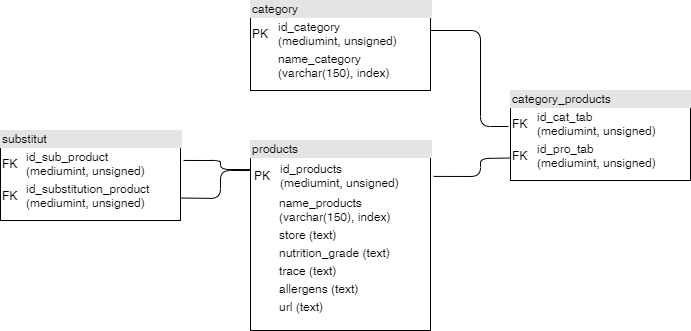

# Projet5
Utilisez les données publiques de l'OpenFoodFacts

## Lancement du programme
 - Installer les dépendances : pip install -r requirements.txt
 - Renommer le fichier ".env.example.txt" par ".env.txt" et y renseigner vos identifiants de connexion pour la base de donnée.
 - Avoir une base de donnée mySQL installée.  
 - Lancer main.py pour lancer le programme en mode graphique.
 
## Option de lancement
 - "--update" ou "-u" pour lancer la mise à jour des catégories.
 - "--terminal" ou "-t" pour lancer le programme en ligne de commande.
 
 Exemple de lancement : 
 main.py --update --terminal 
 Lancement du programme avec les mises à jour et en ligne de commande
 
## Utilisation du programme en ligne de commande
Lors du lancement, l'utilisateur peut choisir entre :
 - 1 : Sélection d'une catégorie
 - 2 : Voir les produits substitués
 - 3 : Quitter
 - L'utilisateur peut sélectionner une action avec le chiffre qui lui est associé.

L'utilisateur a choisi - 1 : Sélectionner une catégorie :
Le système affiche les 20 premières catégories avec un numéro associé.
 - 1 : catégorie 1
 - 2 : catégorie 2
 - L'utilisateur aura le choix de faire défiler avec "z" ou "s" les catégories ou de revenir en arrière avec "a".
Enfin, l'utilisateur pourra sélectionner une catégorie avec le chiffre qui lui sera associé.

L'utilisateur vient de choisir une catégorie, le système affiche les 20 premiers produits de la catégorie.
 - 1 : produit 1
 - 2 : produit 2
 - L'utilisateur aura le choix de faire défiler avec "z" ou "s" les produits ou de revenir en arrière avec "a".
Enfin, l'utilisateur pourra sélectionner un produit avec le chiffre qui lui sera associé.

L'utilisateur a choisi un produit et le système lui présente des substituts.
Le produit est affiché avec quelques caractéristiques (score de nutrition, etc.)
Le système propose une liste de substituts avec les mêmes caractéristiques que le produit sélectionner.
Produit sélectionner : score de nutrition, trace, allergène, où acheter, etc.
 - 1 : substitue 1, score de nutrition, trace, allergène, où acheter, etc.
 - 2 : substitue 2, score de nutrition, trace, allergène, où acheter, etc.
 - L'utilisateur aura le choix de faire défiler avec "z" ou "s" les substitues ou de revenir en arrière avec "a".
Enfin, l'utilisateur pourra sélectionner un substitut avec le chiffre qui lui sera associé.

L'utilisateur a choisi - 2 : Voir les produits substitués
le système affiche une liste de produits qui a des substituts
 - 1 - produit 1 - nom, nombre de substituts.
 - 2 - produit 2 - nom, nombre de substituts.
 - L'utilisateur aura le choix de faire défiler avec "z" ou "s" les produits ou de revenir en arrière avec "a".
Enfin, l'utilisateur pourra sélectionner un produit avec le chiffre qui lui sera associé pour voir les substituts.

L'utilisateur a choisi un produit avec des substituts :
Voir les produits substitués, le système affiche une liste de produits substitués
 - 1 - substitue 1 - score de nutrition, trace, allergène, où acheter, etc.
 - 2 - substitue 2 - score de nutrition, trace, allergène, où acheter, etc.
L'utilisateur aura le choix de faire défiler avec "z" ou "s" les produits ou de revenir en arrière avec "a".
   
## Structure de la base de donnée

